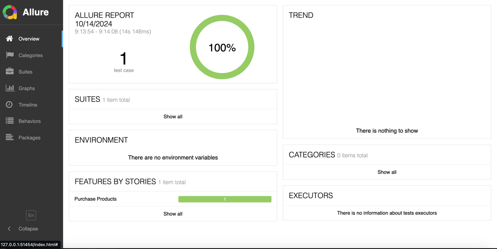
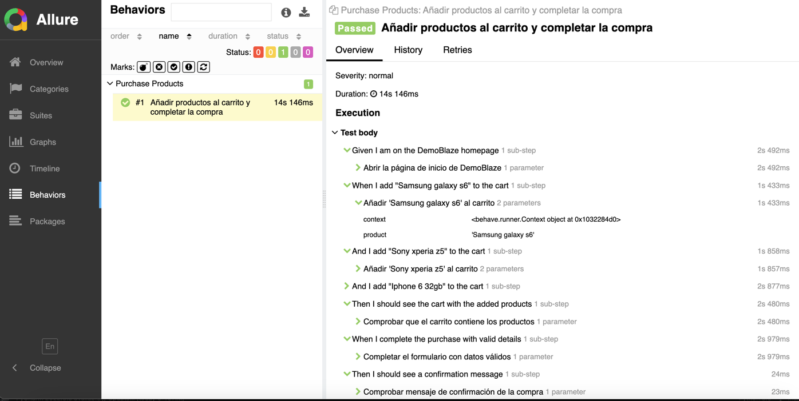

# **Ejercicio Demoblaze - README**

### **Descripción**

Este proyecto implementa pruebas automatizadas de E2E (End-to-End) utilizando **Selenium WebDriver** y **Python** para interactuar con el sitio web **Demoblaze**.  
Los escenarios de prueba incluyen:

1. **Agregar múltiples productos al carrito**.
2. **Verificar los productos en el carrito**.
3. **Completar el formulario de compra**.
4. **Finalizar la compra**.

### **Instrucciones para la ejecución**

#### **Requisitos**

- **Python 3.x** instalado y configurado en el sistema.
- **Selenium** instalado en el entorno de Python.
- Un navegador compatible (Chrome).
- **ChromeDriver**.

### **Pasos para configurar y ejecutar el proyecto**

1. **Clonar el repositorio**  
   Clona el repositorio público desde GitHub. El enlace al repositorio será provisto en la entrega final.

   ```bash
   git clone https://github.com/Xaler01/PruebaTecnica
   cd Demoblaze

2. **Configurar el entorno virtual**  
Crea un entorno virtual para aislar las dependencias del proyecto:  

   ```bash
    python3 -m venv venv
   
    source venv/bin/activate  # Para Mac o Linux    
    
    venv\Scripts\activate   # En Windows   
   
3. **Instalar las dependencias**  
Instala las dependencias del proyecto definidas en requirements.txt:

    ```bash
    pip install -r requirements.txt
   
4. **Ejecutar las pruebas**  
Ejecuta las pruebas automatizadas utilizando behave:

    ```bash
    behave -f allure_behave.formatter:AllureFormatter -o reports/allure_results

5. **Generación de Reportes**  
Después de la ejecución, puede generar y visualizar los reportes con el siguiente comando:

    ```bash
    allure serve reports/allure-results
   
6. **Imagenes de ejemplo de reporte con Allure**  

   
    
    